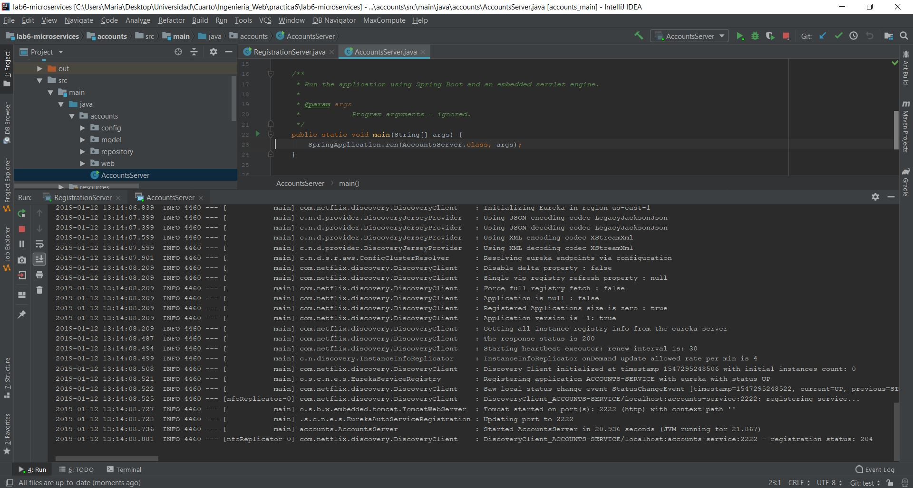
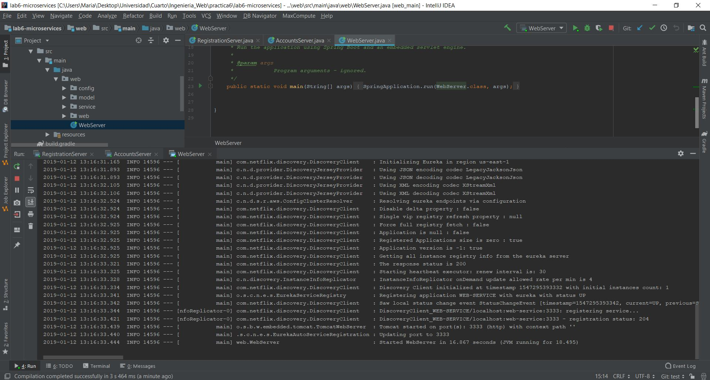
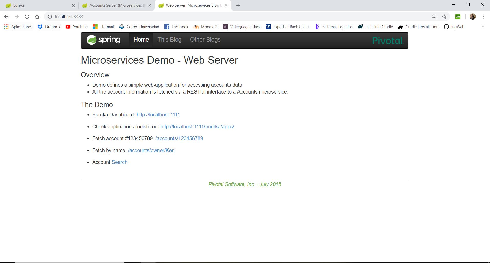
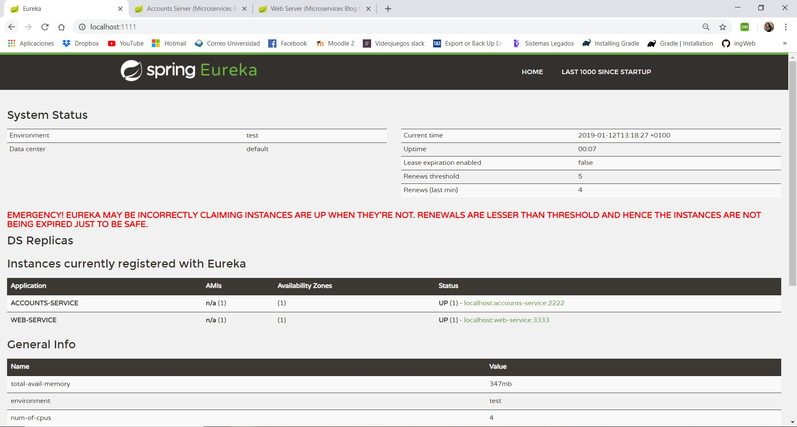
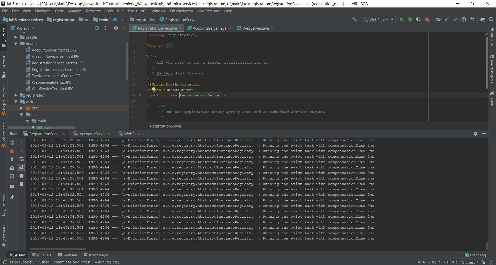
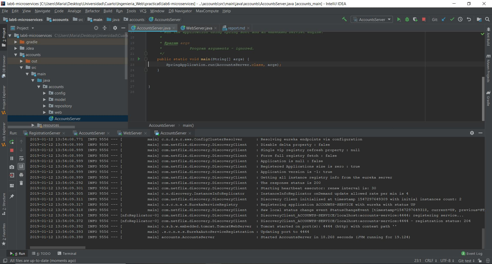
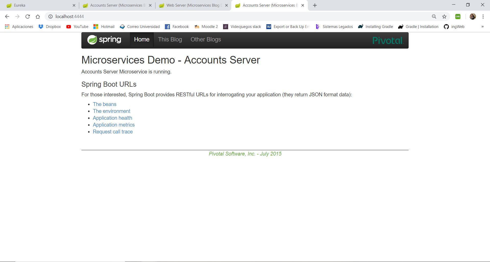
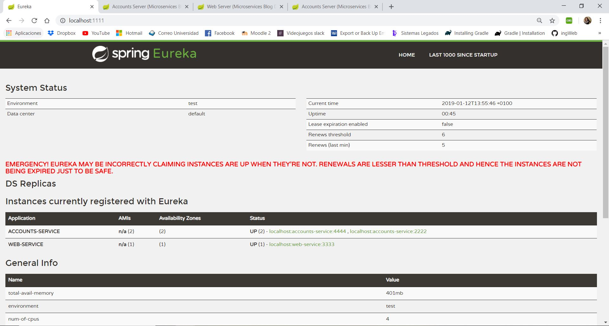

**1- The two microservices are running and registered (two terminals, logs screenshots)**

    Account Service running
   
   
    
    Web Service running
   
   
       
    
**2- The service registration service has the two microservices registered** 
    
    
    
**3- A second account microservice is running in the port 4444 and it is registered**
    Account Service 2 running
   
   
    
    Account Service 2 registered
   
    
**4- A brief report describing what happens when you kill the microservice with port 2222. Can the web service provide information about the accounts? Why?**   
    Return an error message of connection refused, when the Web Server in port 333 connects to the microservice
    in port 2222.So when you try to connect again, when it tries to connect again it 
    asks to the Eureka Registration Server for the Account Service's address and  it 
    gets the right port 4444.